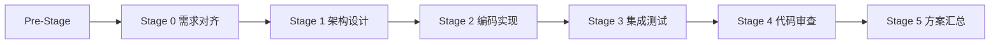

# 夯 — 多团队竞争流水线（Multi-Team Competition Pipeline）

> 基于 gspowers Pipeline 引擎扩展，融入本技能作为团队内部流水线编排。

## 什么是 Pipeline 模式

夯 = 红蓝绿三队并发竞争。每队内部不是散兵游勇，而是 **6 阶段流水线**，阶段间有明确门控和产物交接。三队流水线并行执行，互不阻塞。

---

## 流水线架构

```
                    ┌──────────────┐
                    │  协调者 Phase 1 │  ← 任务拆解 + 假设基线锁定
                    └──────┬───────┘
                           │ 三队共享同一份任务规格
              ┌────────────┼────────────┐
              ▼            ▼            ▼
      ┌────────────┐ ┌────────────┐ ┌────────────┐
      │ 红队 Pipeline │ │ 蓝队 Pipeline │ │ 绿队 Pipeline │
      │ (激进创新)  │ │ (稳健工程)  │ │ (安全保守)  │
      └──────┬─────┘ └──────┬─────┘ └──────┬─────┘
              │              │              │
              └──────────────┼──────────────┘
                             ▼
                    ┌────────────────┐
                    │  Phase 3 裁判评分  │
                    └───────┬────────┘
                            ▼
                    ┌────────────────┐
                    │  Phase 4 汇总融合  │
                    └────────────────┘
```

## 团队内部流水线（Team Internal Pipeline）

每个团队自动执行以下 6 阶段流水线。**上游阶段输出自动成为下游阶段输入。禁止跳过。**

```
Pre-Stage     Stage 0        Stage 1        Stage 2        Stage 3        Stage 4        Stage 5
 物料准备  →   需求对齐  →    架构设计   →    编码实现   →    集成测试   →    代码审查   →    方案汇总
 (协调者)      (全栈开发)     (全栈开发)     (全栈开发)     (集成测试)     (集成测试)     (前端设计师)
    │              │              │              │              │              │              │
    ▼              ▼              ▼              ▼              ▼              ▼              ▼
 PRD文档       对齐记录      架构方案       代码产物       测试报告       审查报告       团队方案
```

### 阶段定义

| 阶段 | 执行者 | 输入 | 产出 | 门控 |
|------|--------|------|------|------|
| Pre-Stage | 协调者 | SDD Excel / 需求描述 | PRD.md | PRD.md 完整通过机械化验证 |
| Stage 0 | 全栈开发 | PRD + 假设基线 | {team}-00-alignment.md | 产出存在即通过 |
| Stage 1 | 全栈开发 | 对齐记录 | {team}-01-architecture.md | 架构方案无歧义 |
| Stage 2 | 全栈开发 + 前端设计师 | 架构方案 | 代码 + {team}-02-implementation.md | 代码可编译/运行 |
| Stage 3 | 集成测试 | 代码产物 | {team}-03-test-report.md | 核心 Happy Path 通过 |
| Stage 4 | 集成测试 | 代码 + 测试报告 | {team}-04-review-report.md | 无 error 级别问题 |
| Stage 5 | 前端设计师 | Stage 0-4 所有产物 | {team}-05-final.md | 完整方案结构 |

## 阶段 DAG



Stage 2 中的前端设计师可并行启动（与全栈开发的后端实现独立）。

## 三队并发模型

| 特性 | 说明 |
|------|------|
| 并行度 | 3 队 × 6 阶段 = 最多 18 个 agent 同时运行 |
| 阻塞模型 | 阶段失败只阻塞该团队，不影响其他团队 |
| 资源隔离 | 各队独立的 prompt 上下文、产物文件、agent 实例 |
| 共享基线 | 三队共享协调者锁定的假设基线，确保方案可比 |

### Agent 分工

| Agent | 流水线阶段 | 模型 |
|-------|-----------|------|
| 全栈开发 | Stage 0-2（对齐→架构→编码） | sonnet (flash) |
| 集成测试 | Stage 3-4（测试→审查） | sonnet (flash) |
| 前端设计师 | Stage 2 UI 并行 + Stage 5 方案汇总 | sonnet (flash) |
| 协调者（本 Skill） | Pre-Stage + Phase 1-4 | pro |

## 任务类型调整

| 任务类型 | Agent 配置 | 流水线策略 |
|----------|-----------|-----------|
| **编码开发** | 3 agent/队 × 3 队 + 裁判 + 汇总 = 11 | 完整 6 阶段 |
| **文档生成** | 2 agent/队 × 3 队 + 裁判 + 汇总 = 8 | 精简 3 阶段（对齐→撰写→审查） |
| **方案评审** | 2 agent/队 × 3 队 + 裁判 + 汇总 = 8 | 快速 2 阶段（分析→论证） |

## 状态追踪

### 团队级状态

| 状态 | 说明 |
|------|------|
| `pending` | 等待执行 |
| `running` | 执行中 |
| `passed` | 通过 |
| `failed` | 失败（阻塞该团队） |
| `skipped` | 跳过（条件触发阶段未满足） |

### 全局阶段

| Phase | 职责 | 状态 |
|-------|------|------|
| Phase 1 | 任务理解与拆解（任务规格 + 假设基线锁定） | 完成 → 进入 Phase 2 |
| Phase 2 | Swarm + Pipeline 并发执行（三队并行） | 全部完成 → 进入 Phase 3 |
| Phase 3 | 裁判评分 | 评分完成 → 进入 Phase 4 |
| Phase 4 | 汇总融合 | 最终方案输出 |

## 门控验证

### 阶段门控（每阶段完成后）

每个阶段完成后执行机械化验证：

```
node .claude/helpers/harness-gate-check.cjs \
  --skill kf-multi-team-compete \
  --stage <N> \
  --team <红/蓝/绿> \
  --required-files "{team}-0<N>-*.md" \
  --forbidden-patterns "TODO" "待定"
```

### 批次间门控（Phase 间）

| 门控 | 检查项 | 失败处理 |
|------|--------|---------|
| Phase 1 → Phase 2 | 任务规格 7 项完整、假设基线已锁定 | 回退 Phase 1 |
| Phase 2 → Phase 3 | 三队全部 Stage 5 完成 | 等待未完成团队 |
| Phase 3 → Phase 4 | 评分卡完整、排名明确 | 回退评分 |
| Phase 4 完成 | 最终方案含融合策略 + 碾压指标 | 回退融合 |

## 执行流程

```
Phase 1 任务拆解
  └── 任务规格锁定 → 假设基线锁定 → Gate 通过

Phase 2 并发执行
  ├── [并行] 红队 Pipeline: Stage0→Stage1→...→Stage5
  ├── [并行] 蓝队 Pipeline: Stage0→Stage1→...→Stage5
  └── [并行] 绿队 Pipeline: Stage0→Stage1→...→Stage5
       │
       └── 每队门控: 阶段产物必须完整，否则阻塞该队

Phase 3 裁判评分
  ├── kf-alignment 对齐评分标准
  ├── 红队评分卡
  ├── 蓝队评分卡
  └── 绿队评分卡
       │
       └── Gate: 评分卡+排名完整

Phase 4 汇总融合
  ├── 择优采纳（冠军领先 >15%）
  ├── 博采众长（冠亚接近 <15%）
  └── 按需融合（三方接近）
       │
       └── 输出最终方案 + 碾压指标
```

## 输出规范

每次执行完成后输出摘要，包含：

1. 任务描述（一句话）
2. 三团队方案对比表（要点 + 评分 + 流水线阶段）
3. 代码审查图谱（kf-code-review-graph）
4. 最终决策（融合策略 + 方案保存路径）
5. 碾压指标（参与 Agent 数、提升比例、覆盖风险维度）

## 触发词

| 触发词 | 说明 |
|--------|------|
| `夯 [任务]` | 启动完整多团队竞争流水线 |
| `多团队竞争` | 同上 |
| `竞争评审` | 同上 |
| `快速夯` | 跳过流水线，双视角快速对比 |

## 与 gspowers Pipeline 的关系

| 方面 | gspowers Pipeline | 夯 Pipeline |
|------|-------------------|-------------|
| 适用场景 | 单项目多模块顺序开发 | 多团队并发竞争评审 |
| 执行方式 | 批次并行 + 批次串行 | 三队完全并行 + 队内串行 |
| 依赖处理 | DAG 拓扑排序 | 线性阶段 DAG |
| 并发粒度 | 批次内模块并行 | 团队间并行 + 团队内串行 |
| 状态粒度 | 模块级 | 团队 × 阶段级 |
| 门控 | 批次间门控 | 阶段门控 + Phase 门控 |
| 失败影响 | 阻塞后续批次 | 只阻塞该团队 |
