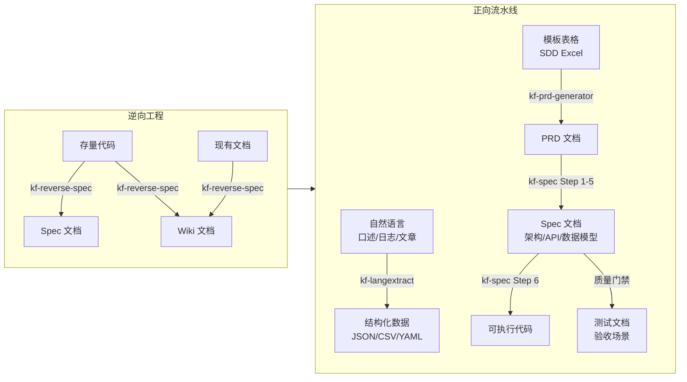

<p align="center">
  <a href="https://github.com/1234567KF/ChronoCoding/blob/main/安装或更新/AICoding.md">
    
  </a>
  <a href="LICENSE">
    
  </a>
</p>

# AI编程智驾 — 让 AI 自动驾驶编程全流程

> 如果你是人类，请阅读本文档了解原理。
用法：最简单方式使用—— 一个字 夯 放在任务描述前即可。
安装与更新：请复制下面这段话，分享给你的朋友。

## 分享给朋友（一键复制）

> 海报中的 **铁三角**（协作者·节流者·监测者）就是朋友安装后将获得的完整能力：
> **协作者** — 多 Agent 竞争评审引擎，夯 · 竞争择优
> **节流者** — KV Cache 120x 杠杆 + 模型路由 + 上下文压缩，Token 节省 40-83%
> **监测者** — 实时 Token 追踪 + 成本仪表盘 + 缓存命中看板

**把下面这段话复制发给朋友。朋友无需安装任何东西——粘贴给任意 AI（Claude Code / Trae / Cursor / Qoder / CodeBuddy / Antigravity / AI Studio 甚至网页版 AI）即可自动完成全部安装配置：**

```
🤖 AI 请执行：

我是 AI编程智驾（铁三角：协作者+节流者+监测者）的安装助手。
请访问 https://github.com/1234567KF/ChronoCoding/blob/main/安装或更新/AICoding.md
严格按其中的阶段0-5完成安装配置。
如果用户还没有 AI 编程工具 → 先引导安装 Claude Code（irm https://claude.ai/install.ps1 | iex）
如果用户已有 Claude Code → 说"执行安装"从头开始
如果已有安装要升级 → 说"执行更新"完成升级
如无法访问URL请引导用户手动下载该文件。
```

> 朋友那边无需下载任何文件，只需把上面这段话粘贴给任意 AI，AI 自动处理从环境检测、工具安装、Token 配置到铁三角全部技能就绪的完整流程。

---


<p align="center">
  
</p>

<p align="center">
  
</p>

<p align="center">
  
</p>


## 系统架构

<p align="center">
  
</p>

---

## 工程流水线

本项目实现了完整的**逆向工程**与**正向工程**双流水线，覆盖从非结构化信息到交付物的全链路自动化。



### 逆向工程 — 已有资产 → 结构化知识

从存量代码和现有文档中提取架构、数据模型、API 契约、业务逻辑，生成可维护的知识资产。

| 方向 | 输入 | 流程 | 输出 | 执行技能 |
|------|------|------|------|---------|
| **代码→Wiki** | 存量代码目录 / Git 仓库 | St0 对齐 → St1 侦察 → St2 制图 → St3 成文 → St4 审查 | Spec 11 节 + Wiki 多页文档 + 架构图 | kf-reverse-spec |
| **代码→Spec** | 存量代码目录 / Git 仓库 | 同上，Stage 2 直接输出 | Spec 文档（11 节标准框架） | kf-reverse-spec |
| **文档→Wiki** | 存量文档 / 设计文档 / README | kf-reverse-spec Stage 3 Format A | GitHub Wiki 风格多页文档（Home/Architecture/Modules/API/FAQ） | kf-reverse-spec |

### 正向流水线 — 模糊需求 → 交付物

从非结构化信息出发，逐层结构化，最终产出可执行代码与测试文档。

| 阶段 | 输入 | 流程 | 输出 | 执行技能 | 原则 |
|------|------|------|------|---------|:----:|
| **自然语言→结构化** | 非结构化文本（日志/报告/合同/病历） | Schema 定义 → few-shot 构建 → `lx.extract()` 执行 | JSON / CSV / YAML（每个值可溯源到原文位置） | kf-langextract | 准 |
| **模板表格→PRD** | SDD 需求采集 Excel（.xlsx） | Sheet 映射 → 需求问询 → 交叉验证 → 生成 | PRD.md（结构化业务需求文档） | kf-prd-generator | 快 |
| **PRD→Spec** | PRD.md | 需求澄清 → v0.1 生成 → 人工审查 → 质量门禁 → v1.0 定稿 | Spec.md + 可选：API契约/数据模型/状态图 | kf-spec（Step 1-5） | 快 |
| **Spec→代码** | Spec 文档 + 任务清单 | 任务分解 DAG → 分步执行（逐步/全量/手动）→ 逐任务验收 | 可运行代码（分阶段交付） | kf-spec（Step 6） | 夯 |
| **Spec→测试文档** | Spec 验收标准 + 质量门禁 | 门禁逐项检查 → 验收场景提取 → 测试计划生成 | 测试计划 / Gherkin 验收场景 / 质量报告 | kf-spec（质量门禁）+ kf-browser-ops | 测的准 |

### 流水线衔接示例

```
原始需求 "做个用户管理系统"
  │
  ├─ 口述 / 笔记 ──→ kf-langextract ──→ 结构化需求清单
  │
  ├─ SDD Excel ────→ kf-prd-generator ──→ PRD.md
  │
  ├─ PRD.md ───────→ kf-spec ──────────→ Spec.md + tasks.md
  │                                         │
  │                                         ├→ 分步编码 → 可运行代码
  │                                         └→ 质量门禁 → 测试文档
  │
  └─ 存量系统改造 ──→ kf-reverse-spec ──→ Wiki 文档 + 架构图
```

---


## 六字真言

| 原则 | 含义 | 对应技能 |
|------|------|---------|
| **稳** | 好用不贵，长期维护 | gspowers、gstack、kf-skill-design-expert、kf-add-skill、kf-reverse-skill、kf-doc-consistency |
| **省** | 模型搭配，稳固 ROI | kf-model-router、kf-code-review-graph、lean-ctx |
| **准** | 多源搜索 + 反反爬 + 平台直取 + 代码搜索 + 结构化提取，精准调研 | kf-web-search、kf-scrapling、kf-opencli、kf-exa-code、markdown-to-docx、kf-go、bili-extract、harness-code-dev、observability-designer、performance-profiler、kf-langextract |
| **夯** | 多 Agent 并发竞争碾压 | kf-multi-team-compete、kf-triple-collaboration |
| **快** | MVP 快速验证，多工具速出原型 | kf-prd-generator、kf-ui-prototype-generator、kf-spec、kf-image-editor、markdown-to-docx |
| **懂** | 动前对齐，动后 diff | kf-alignment |

## 项目技术路径

从零到全面生态，AI编程智驾的发展历程展示了**协作者**的持续进化与整个系统的协同演进：

<div style="margin: 16px auto; max-width: 760px;">

<!-- 1 -->
<div style="display: flex; align-items: stretch; margin-bottom: 12px;">
  <div style="min-width: 8px; background: #e3f2fd; border-radius: 8px 0 0 8px;"></div>
  <div style="flex: 1; padding: 8px 14px; background: #f5f5f5; border-radius: 0 8px 8px 0; font-size: 13px; line-height: 1.6; border-left: 3px solid #1565C0;">
    <strong>初始集成</strong> — Claude Code API + gstack + superpowers 搭建基础框架，验证 AI 编程工作流的可行性
  </div>
</div>

<!-- 2 -->
<div style="display: flex; align-items: stretch; margin-bottom: 12px;">
  <div style="min-width: 8px; background: #e8f5e9; border-radius: 8px 0 0 8px;"></div>
  <div style="flex: 1; padding: 8px 14px; background: #f5f5f5; border-radius: 0 8px 8px 0; font-size: 13px; line-height: 1.6; border-left: 3px solid #2E7D32;">
    <strong>流程导航</strong> — 集成 <code>gspowers</code> SOP 导航引擎，<code>gstack</code> 产品流程框架，实现标准化工作流
  </div>
</div>

<!-- 3 -->
<div style="display: flex; align-items: stretch; margin-bottom: 12px;">
  <div style="min-width: 8px; background: #fff3e0; border-radius: 8px 0 0 8px;"></div>
  <div style="flex: 1; padding: 8px 14px; background: #f5f5f5; border-radius: 0 8px 8px 0; font-size: 13px; line-height: 1.6; border-left: 3px solid #E65100;">
    <strong>铁三角奠基</strong> — 自建 kf- 技能体系，三大角色分工：
    <div style="margin-top: 4px; font-size: 12px; color: #555;">
      1️⃣ <strong>协作者</strong> <code>kf-multi-team-compete</code> — 红蓝绿三队 Agent 并发竞争评审<br>
      2️⃣ <strong>节流者</strong> <code>kf-model-router</code> + <code>lean-ctx</code> + <code>CCP</code> + <code>lambda</code> — 模型路由 + 上下文压缩 + 智能调度<br>
      3️⃣ <strong>监测者</strong> <code>kf-token-tracker</code> + <code>Monitor</code> 看板 — 实时 Token 追踪 + 成本仪表盘
    </div>
  </div>
</div>

<!-- 4: 协作者进化 -->
<div style="display: flex; align-items: stretch; margin-bottom: 12px;">
  <div style="min-width: 8px; background: #e8eaf6; border-radius: 8px 0 0 8px;"></div>
  <div style="flex: 1; padding: 8px 14px; background: #f5f5f5; border-radius: 0 8px 8px 0; font-size: 13px; line-height: 1.6; border-left: 3px solid #283593;">
    <strong>协作者进化 · Pipeline 驱动</strong> — 从竞争到协同，协作者能力的持续跃迁：
    <div style="margin-top: 4px; font-size: 12px; color: #555;">
      v1 <strong>单一 Agent</strong> → 串行编码<br>
      v2 <strong>红蓝对决</strong> → 两 Agent 竞争评审<br>
      v3 <strong>三队 Pipeline</strong> → gspowers 流水线引擎集成，每队 6 阶段（对齐→架构→UI→测试→审查→汇总）<br>
      v4 <strong>工具箱扩充</strong> → 每队注入 11+ 技能（web-search + scrapling + opencli + exa-code + image-editor + browser-ops + code-review-graph + ...）<br>
      v5 <strong>生态自治</strong> → 自安装技能 + 自检文档 + 自适应模型路由，系统自我维护
    </div>
  </div>
</div>

<!-- 5: 精准调研套件 -->
<div style="display: flex; align-items: stretch; margin-bottom: 12px;">
  <div style="min-width: 8px; background: #fce4ec; border-radius: 8px 0 0 8px;"></div>
  <div style="flex: 1; padding: 8px 14px; background: #f5f5f5; border-radius: 0 8px 8px 0; font-size: 13px; line-height: 1.6; border-left: 3px solid #C62828;">
    <strong>精准调研套件（准系扩充）</strong> — 数据采集从单点到矩阵：
    <div style="margin-top: 4px; font-size: 12px; color: #555;">
      ├─ <code>kf-web-search</code> — 多引擎搜索（基础层）<br>
      ├─ <code>kf-scrapling</code> — 深度爬虫 + 反反爬（穿透层）<br>
      ├─ <code>kf-opencli</code> — 100+ 平台 CLI 直取（中间层）<br>
      ├─ <code>kf-exa-code</code> — Exa MCP 代码上下文引擎（代码层）<br>
      ├─ <code>kf-langextract</code> — 非结构化→结构化提取（解析层）<br>
      ├─ <code>kf-grant-research</code> — 学术课题研究助手（科研层）<br>
      └─ <code>kf-kb-envoy</code> — 知识库全生命周期管理（沉淀层）<br>
      <em>七层精准调研体系，覆盖搜索→穿透→直取→代码→解析→科研→沉淀全链路</em>
    </div>
  </div>
</div>

<!-- 6: 生态自治 -->
<div style="display: flex; align-items: stretch; margin-bottom: 12px;">
  <div style="min-width: 8px; background: #fff8e1; border-radius: 8px 0 0 8px;"></div>
  <div style="flex: 1; padding: 8px 14px; background: #f5f5f5; border-radius: 0 8px 8px 0; font-size: 13px; line-height: 1.6; border-left: 3px solid #F9A825;">
    <strong>生态自治</strong> — 系统自我维护能力成熟：
    <div style="margin-top: 4px; font-size: 12px; color: #555;">
      ├─ <code>kf-add-skill</code> — 关键词搜索→下载安装→文档全同步<br>
      ├─ <code>kf-doc-consistency</code> — 文档全局一致性自动修复<br>
      ├─ <code>kf-skill-design-expert</code> — 五根铁律质量审计<br>
      ├─ <code>kf-model-router</code> — 模型自动切换（pro↔flash）用户无感<br>
      ├─ <code>claude-code-pro</code> — 智能调度：不 spawn 省 10K-15K token<br>
      └─ <code>lambda-lang</code> — Agent 间压缩通信（3x 压缩）<br>
      <em>六项自治能力 → 铁三角进化为全自动生态系统</em>
    </div>
  </div>
</div>

</div>

---

## 第三方开源集成

本项目集成了以下优秀的开源项目：

| 集成项目 | 来源 | 许可证 | 用途 |
|----------|------|--------|------|
| [gspowers](https://github.com/fshaan/gspowers) | fshaan | MIT | SOP 流程导航 |
| [gstack](https://github.com/garrytan/gstack) | garrytan | — | 产品流程框架 |
| [Scrapling](https://github.com/D4Vinci/Scrapling) | D4Vinci | BSD-3-Clause | Web 爬虫 + 反反爬 |
| [frontend-slides](https://github.com/zarazhangrui/frontend-slides) | zarazhangrui | MIT | 演示文稿生成 |
| [ruflo](https://github.com/ruvnet/ruflo) | ruvnet | MIT | 多 Agent 编排 |
| [lean-ctx](https://github.com/garrytan/lean-ctx) | garrytan | MIT | 上下文压缩引擎，90+ 压缩模式 |
| [context-mode](https://github.com/mksglu/context-mode) | mksglu | Elastic-2.0 | 会话连续性 + 压缩存活 |
| [claude-mem](https://github.com/thedotmack/claude-mem) | thedotmack | AGPL-3.0 | 跨会话持久记忆（SQLite + Chroma 向量库） |
| [OpenCLI](https://github.com/jackwener/OpenCLI) | jackwener | MIT | 100+ 平台 CLI 数据直取，AI 原生浏览器自动化 |
| [autoresearch](https://github.com/karpathy/autoresearch) | karpathy | MIT | 自主 ML 实验：AI 整夜改模型→训练→验证→循环 |
| [jeffallan/claude-skills](https://github.com/jeffallan/claude-skills) | jeffallan | MIT | 66 个 Claude Code 第三方技能：语言/后端/前端/基础设施/API/测试/DevOps/安全/数据ML/平台 |

详见 [CREDITS.md](安装或更新/docs/CREDITS.md) 完整致谢。

---

## 快速开始

### 前置要求

- Claude Code 已安装
- Node.js >= 18
- Git

### 方式零：复制粘贴（零门槛，推荐分享给朋友）

**不需要下载任何文件。** 复制「分享给朋友」区块中的文本，粘贴给任意 AI，AI 自动完成全部安装。

```
把这段话复制给 AI → AI 自动获取 AICoding.md → 自动安装 → 完成
```

### 方式一：单文件入口

**只需下载一个文件**，放入 AI IDE，AI 自动完成全部安装：

```
1. 下载 安装或更新/AICoding.md
2. 放入任意目录，用 AI IDE（Claude Code / Trae / Cursor）打开
3. 对 AI 说"执行安装"
4. AI 自动完成：环境检测 → 下载项目 → 安装配置 → 铁三角全部技能就绪
```

> `AICoding.md` 内容永远不需要更新——用户说"执行安装"或"执行更新"，AI 从 GitHub 实时拉取最新仓库和安装指南。

### 方式二：AI 自动安装

将整个项目给 AI 阅读，AI 自动完成所有配置：

```
1. 将项目文件夯复制到新环境
2. 在项目目录打开 Claude Code
3. 让 AI 阅读 INSTALL.md
4. AI 自动完成所有安装（仅需用户配置 Token）
```

### 方式三：手动安装

```powershell
# 安装 Claude Code
irm https://claude.ai/install.ps1 | iex

# 安装 ruflo
npm install -g ruflo

# 安装 gspowers
git clone https://github.com/fshaan/gspowers.git ~/.claude/skills/gspowers
```

详见 [INSTALL.md](安装或更新/docs/INSTALL.md)

---

## 功能触发词

| 触发词 | 功能 | 来源 |
|--------|------|------|
| `/go` / `/导航` / `/开始` | 工作流导航 | kf-go |
| `/gspowers` | 启动 SOP 流程导航 | gspowers |
| `triple [任务]` | 通用三方协作 | kf-triple-collaboration |
| `spec coding` / `写spec文档` | Spec 驱动开发 | kf-spec |
| `/prd-generator` | PRD 文档生成 | kf-prd-generator |
| `/夯 [任务]` | 多团队竞争评审（主入口） | kf-multi-team-compete |
| `/对齐` / `说下你的理解` | 对齐工作流 | kf-alignment |
| `/review-graph` | 代码审查依赖图谱 | kf-code-review-graph |
| `/web-search [问题]` | 多引擎智能搜索 | kf-web-search |
| `爬虫` / `抓取` / `scrape` | Web 爬虫 + 反反爬 | kf-scrapling |
| `热榜` / `平台抓取` / `CLI数据` / `opencli` | 100+ 平台 CLI 数据直取 | kf-opencli |
| `/browser-ops` | 浏览器自动化测试 | kf-browser-ops |
| `P图` / `改图` / `修图` / `去水印` | AI 自然语言 P 图 | kf-image-editor |
| `摄入文件` / `ingest` / `lint` / `检查知识库` / `更新知识库` | Knowledge Base Envoy：知识库全生命周期管理 | kf-kb-envoy |
| `Harness 评审` / `五根铁律审计` | Skill 质量审计 | kf-skill-design-expert |
| `/token-tracker` / `/skill-monitor` / `技能监控` / `使用率` / `token成本` | Token全量追踪 + 技能调用追踪 + 成本估算 | kf-token-tracker |
| `模型路由` / `省模式` | 模型智能路由（全自动） | kf-model-router |
| `自动实验` / `ai实验` / `实验跑一夜` / `autoresearch` | Karpathy 自主 ML 实验 | kf-autoresearch |
| `一致性` / `文档自检` / `doc consistency` | 文档全局一致性自检 | kf-doc-consistency |
| `逆向` / `存量代码` / `代码扫描` / `逆向工程` | 存量代码→Spec/文档 逆向流水线 | kf-reverse-spec |
| `装技能` / `安装技能` / `添加技能` / `搜索技能` | 技能安装管家 | kf-add-skill |
| `课题申报` / `科研项目` / `国自然` / `研究计划` | 课题申报研究助手 | kf-grant-research |
| `提取` / `结构化提取` / `parse` / `langextract` | LLM 驱动结构化提取，非结构化文本→JSON/CSV/YAML | kf-langextract |
| `exa-code` / `查代码示例` / `找API用法` / `代码搜索` / `查库文档` | Exa Code — Web 规模代码上下文引擎，自动知识缺口检测 | kf-exa-code |
| `进化` / `自我优化` / `evolve` | AI 自我优化与迭代改进 | kf-evolution |
| `监测者` / `仪表盘` / `dashboard` / `token监测` | 监测者仪表盘：Token 追踪 + 重审触发检测 + 成本分析 | kf-monitor |
| `节省追踪` / `saver` / `成本节省` | 会话成本节省追踪，自动记录 API 调用节省数据 | kf-saver |
| `λ` / `lambda` / `!ta ct` / `@v2.0#h` / `agent通信` | Agent 间 Lambda 压缩通信（自动注入） | lambda-lang |
| `ccp` / `智能调度` / `回调` | Token 高效调度：不 spawn 则省 10K-15K token | claude-code-pro |

---

## 文档结构

| 文档 | 说明 |
|------|------|
| [README.md](README.md) | 项目介绍（你在这里） |
| [AICoding.md](安装或更新/AICoding.md) | 单文件入口（给 AI 看） |
| [MANUAL.md](安装或更新/docs/MANUAL.md) | 完整使用手册（给人看） |
| [INSTALL.md](安装或更新/docs/INSTALL.md) | AI 执行安装指南（给 AI 看） |
| [CHANGELOG.md](CHANGELOG.md) | 版本变更记录 |
| [FEATURES.md](安装或更新/docs/FEATURES.md) | 功能特性介绍 |
| [CREDITS.md](安装或更新/docs/CREDITS.md) | 第三方开源项目致谢 |

---

## 目录结构

```
AI编程智驾/
├── README.md              # 项目入口
├── AICoding.md            # 单文件入口（给 AI 看）
├── CHANGELOG.md           # 版本记录
├── CONTRIBUTING.md        # 贡献指南
├── LICENSE                # LGPL-3.0 许可证
├── assets/                # 静态资源（宣传海报、架构图）
│   └── posters/
│
├── .claude/               # Claude Code 项目配置
│   ├── CLAUDE.md          # 项目指令
│   ├── settings.json      # 项目配置
│   ├── helpers/                   # Hook 处理器 + 审计脚本
│   │   ├── harness-gate-check.cjs # 机械化门控验证
│   │   ├── harness-audit.cjs      # 五根铁律全路径审计
│   │   ├── skill-validator.cjs    # SKILL.md 行为级验证框架
│   │   ├── review-rerun-check.cjs # 条件重审触发判断
│   │   ├── quality-signals.cjs    # 标准化质量信号发射器
│   │   ├── cache-audit.cjs        # DeepSeek KV Cache 前缀一致性审计
│   │   ├── key-isolator.cjs       # 多供应商密钥隔离
│   │   ├── rate-limiter.cjs       # 令牌桶限流
│   │   ├── ccp-smart-dispatch.cjs # CCP 智能调度 + Lambda 注入
│   │   └── ...                    # +6 其他 helper
│   ├── agents/            # Agent 定义
│   ├── commands/          # 自定义命令
│   └── skills/            # 技能（kf- 系列 + 上游）
│       ├── kf-spec/                # Spec 驱动开发
│       ├── kf-code-review-graph/   # 代码审查图谱
│       ├── kf-web-search/          # 多引擎搜索
│       ├── kf-browser-ops/         # 浏览器自动化
│       ├── kf-multi-team-compete/  # 多团队竞争评审
│       ├── kf-alignment/           # 对齐工作流
│       ├── kf-autoresearch/        # AI 自主 ML 实验
│       ├── kf-model-router/        # 模型路由
│       ├── kf-prd-generator/       # PRD 生成器
│       ├── kf-triple-collaboration/# 三方协作
│       ├── kf-ui-prototype-generator/ # UI 原型
│       ├── kf-skill-design-expert/ # Skill 设计
│       ├── kf-token-tracker/        # Token全量追踪 + 技能调用链路
│       ├── kf-add-skill/           # 技能安装管家
│       ├── kf-doc-consistency/     # 文档一致性自检
│       ├── kf-go/                  # 工作流导航
│       ├── kf-grant-research/      # 课题申报研究助手
│       ├── kf-image-editor/        # AI 自然语言 P 图
│       ├── kf-kb-envoy/            # Knowledge Base Envoy
│       ├── kf-exa-code/            # Exa Code — Web 规模代码上下文引擎
│       ├── kf-opencli/             # OpenCLI — 100+ 平台 CLI 数据直取
│       ├── kf-reverse-spec/        # 存量代码→Spec 逆向
│       ├── kf-scrapling/           # Web 爬虫 + 反反爬
│       ├── kf-langextract/         # LLM 驱动结构化提取
│       ├── kf-evolution/            # 进化机制：AI 自我优化与迭代
│       ├── kf-monitor/              # 监测者仪表盘：Token 追踪 + 重审检测
│       ├── kf-saver/                # 会话成本节省追踪
│       ├── kf-safe-router/          # 安全路由组件库
│       ├── kf-smart-router/         # 多供应商模型适配器插件库
│       ├── lambda-lang/             # Agent-to-Agent 原生语言
│       ├── claude-code-pro/         # Token 高效调度
│       ├── lean-ctx/                # 上下文压缩引擎
│       ├── gspowers/               # SOP 导航（上游）
│       └── gstack/                 # 产品流程（上游）
│
├── 监测者/monitor/          # Token 追踪监测仪表盘
│   ├── src/
│   │   ├── server.js       # Express 服务端（端口 3456）
│   │   ├── db/             # SQLite 数据库 + Schema
│   │   ├── api/            # REST API 端点
│   │   ├── collector/      # 数据采集器
│   │   └── watcher.js      # 文件监听 + 重审检测
│   ├── client/             # EJS 前端页面
│   ├── scripts/            # 安装/运维脚本
│   └── package.json
│
├── templates/             # 配置模板
│   ├── settings.json.template
│   ├── config.yaml.template
│   ├── tdd-config.yaml.template
│   ├── pre-commit.template
│   ├── pipeline-example.md
│   └── wiki-template.md
│
└── kf-gspowers-pipeline-patch/  # Pipeline 扩展
    ├── pipeline.md
    ├── execute-patch.md
    └── install-pipeline.ps1
```

---

## 贡献

欢迎提交 Issue 和 Pull Request！

见 [CONTRIBUTING.md](CONTRIBUTING.md)

---

## 许可

LGPL-3.0 - 详见 [安装或更新/LICENSE](安装或更新/LICENSE)
