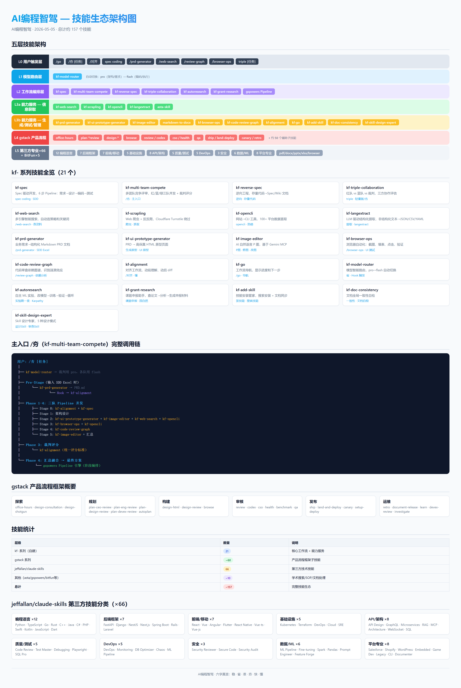

<p align="center">
  <a href="https://github.com/1234567KF/AutoCoding/blob/main/AICoding.md">
    
  </a>
  <a href="LICENSE">
    
  </a>
</p>

# AI编程智驾 — 让 AI 自动驾驶编程全流程

> 从环境搭建到代码交付，零手动干预。只需一个文件，放进 AI IDE，全自动完成。
>
> 总纲：[AICoding原则.docx](docs/AICoding原则.docx) — **稳 · 省 · 准 · 夯 · 快 · 懂**

<p align="center">
  
</p>

**AI编程智驾** 是一套完整的 AI 编程工作台，遵循七大原则，集成 Claude Code、gspowers SOP 导航、claude-flow 多 Agent 并行执行，21 个自建 kf- 系列技能覆盖从 PRD 到 Spec 到编码到审查的全链路。

---

## 系统架构

<p align="center">
  
</p>

---

## 分享给朋友（一键复制）

**把下面这段话复制发给朋友，他丢给任意 AI（Claude Code / ChatGPT / Trae / Cursor）即可自动完成全部安装配置：**

```
🤖 AI 请执行：

访问 https://github.com/1234567KF/AICoding/blob/main/AICoding.md
严格按其中的阶段0-5完成安装配置。
说"执行安装"从头开始，说"执行更新"升级已有安装。
如无法访问URL请引导用户手动下载该文件。
```

> 朋友那边无需装任何东西，无需下载任何文件，只需把上面这段话粘贴给 AI。

---

## 六字真言

| 原则 | 含义 | 对应技能 |
|------|------|---------|
| **稳** | 好用不贵，长期维护 | gspowers、gstack、kf-skill-design-expert、kf-add-skill、kf-reverse-skill、kf-doc-consistency |
| **省** | 模型搭配，稳固 ROI | kf-model-router、kf-code-review-graph、RTK |
| **准** | 多源搜索 + 反反爬 + 平台直取 + 结构化提取，精准调研 | kf-web-search、kf-scrapling、kf-opencli、markdown-to-docx、kf-go、bili-extract、harness-code-dev、observability-designer、performance-profiler、kf-langextract |
| **夯** | 多 Agent 并发竞争碾压 | kf-multi-team-compete、kf-triple-collaboration |
| **快** | MVP 快速验证，多工具速出原型 | kf-prd-generator、kf-ui-prototype-generator、kf-spec、kf-image-editor、markdown-to-docx |
| **懂** | 动前对齐，动后 diff | kf-alignment |


---

## 第三方开源集成

本项目集成了以下优秀的开源项目：

| 集成项目 | 来源 | 许可证 | 用途 |
|----------|------|--------|------|
| [gspowers](https://github.com/fshaan/gspowers) | fshaan | MIT | SOP 流程导航 |
| [gstack](https://github.com/garrytan/gstack) | garrytan | — | 产品流程框架 |
| [Scrapling](https://github.com/D4Vinci/Scrapling) | D4Vinci | BSD-3-Clause | Web 爬虫 + 反反爬 |
| [frontend-slides](https://github.com/zarazhangrui/frontend-slides) | zarazhangrui | MIT | 演示文稿生成 |
| [ruflo](https://github.com/ruvnet/ruflo) | ruvnet | MIT | 多 Agent 编排 |
| [RTK](https://github.com/rafaelkallis/rtk) | rafaelkallis | MIT | Token 优化 |
| [context-mode](https://github.com/mksglu/context-mode) | mksglu | Elastic-2.0 | 会话连续性 + 压缩存活 |
| [claude-mem](https://github.com/thedotmack/claude-mem) | thedotmack | AGPL-3.0 | 跨会话持久记忆（SQLite + Chroma 向量库） |
| [OpenCLI](https://github.com/jackwener/OpenCLI) | jackwener | MIT | 100+ 平台 CLI 数据直取，AI 原生浏览器自动化 |
| [autoresearch](https://github.com/karpathy/autoresearch) | karpathy | MIT | 自主 ML 实验：AI 整夜改模型→训练→验证→循环 |
| [asta-skill](https://github.com/Agents365-ai/asta-skill) | Agents365-ai | MIT | 学术论文搜索 — Semantic Scholar via Ai2 Asta MCP |
| [jeffallan/claude-skills](https://github.com/jeffallan/claude-skills) | jeffallan | MIT | 66 个 Claude Code 第三方技能：语言/后端/前端/基础设施/API/测试/DevOps/安全/数据ML/平台 |

详见 [CREDITS.md](docs/CREDITS.md) 完整致谢。

---

## 快速开始

### 前置要求

- Claude Code 已安装
- Node.js >= 18
- Git

### 方式零：复制粘贴（零门槛，推荐分享给朋友）

**不需要下载任何文件。** 复制「分享给朋友」区块中的文本，粘贴给任意 AI，AI 自动完成全部安装。

```
把这段话复制给 AI → AI 自动获取 AICoding.md → 自动安装 → 完成
```

### 方式一：单文件入口

**只需下载一个文件**，放入 AI IDE，AI 自动完成全部安装：

```
1. 下载 AICoding.md（本仓库根目录）
2. 放入任意目录，用 AI IDE（Claude Code / Trae / Cursor）打开
3. 对 AI 说"执行安装"
4. AI 自动完成：环境检测 → 下载项目 → 安装配置 → 完成
```

> `AICoding.md` 只有 ~100 行，内容永远不需要更新——它从 GitHub 实时拉取最新仓库。

### 方式二：AI 自动安装

将整个项目给 AI 阅读，AI 自动完成所有配置：

```
1. 将项目文件夹复制到新环境
2. 在项目目录打开 Claude Code
3. 让 AI 阅读 INSTALL.md
4. AI 自动完成所有安装（仅需用户配置 Token）
```

### 方式三：手动安装

```powershell
# 安装 Claude Code
irm https://claude.ai/install.ps1 | iex

# 安装 ruflo
npm install -g ruflo

# 安装 gspowers
git clone https://github.com/fshaan/gspowers.git ~/.claude/skills/gspowers
```

详见 [INSTALL.md](docs/INSTALL.md)

---

## 功能触发词

| 触发词 | 功能 | 来源 |
|--------|------|------|
| `/go` / `/导航` / `/开始` | 工作流导航 | kf-go |
| `/gspowers` | 启动 SOP 流程导航 | gspowers |
| `triple [任务]` | 通用三方协作 | kf-triple-collaboration |
| `spec coding` / `写spec文档` | Spec 驱动开发 | kf-spec |
| `/prd-generator` | PRD 文档生成 | kf-prd-generator |
| `/夯 [任务]` | 多团队竞争评审（主入口） | kf-multi-team-compete |
| `/对齐` / `说下你的理解` | 对齐工作流 | kf-alignment |
| `/review-graph` | 代码审查依赖图谱 | kf-code-review-graph |
| `/web-search [问题]` | 多引擎智能搜索 | kf-web-search |
| `爬虫` / `抓取` / `scrape` | Web 爬虫 + 反反爬 | kf-scrapling |
| `热榜` / `平台抓取` / `CLI数据` / `opencli` | 100+ 平台 CLI 数据直取 | kf-opencli |
| `/browser-ops` | 浏览器自动化测试 | kf-browser-ops |
| `P图` / `改图` / `修图` / `去水印` | AI 自然语言 P 图 | kf-image-editor |
| `转docx` / `markdown转word` | Markdown → DOCX 转换 | kf-markdown-to-docx-skill |
| `Harness 评审` / `五根铁律审计` | Skill 质量审计 | kf-skill-design-expert |
| `模型路由` / `省模式` | 模型智能路由（全自动） | kf-model-router |
| `自动实验` / `ai实验` / `实验跑一夜` / `autoresearch` | Karpathy 自主 ML 实验 | kf-autoresearch |
| `一致性` / `文档自检` / `doc consistency` | 文档全局一致性自检 | kf-doc-consistency |
| `逆向` / `存量代码` / `代码扫描` / `逆向工程` | 存量代码→Spec/文档 逆向流水线 | kf-reverse-spec |
| `装技能` / `安装技能` / `添加技能` / `搜索技能` | 技能安装管家 | kf-add-skill |
| `课题申报` / `科研项目` / `国自然` / `研究计划` | 课题申报研究助手 | kf-grant-research |
| `论文` / `查论文` / `学术搜索` / `文献` | Semantic Scholar 学术论文搜索 | asta-skill |
| `提取` / `结构化提取` / `parse` / `langextract` | LLM 驱动结构化提取，非结构化文本→JSON/CSV/YAML | kf-langextract |

---

## 文档结构

| 文档 | 说明 |
|------|------|
| [README.md](README.md) | 项目介绍（你在这里） |
| [AICoding.md](AICoding.md) | 单文件入口（给 AI 看） |
| [MANUAL.md](docs/MANUAL.md) | 完整使用手册（给人看） |
| [INSTALL.md](docs/INSTALL.md) | AI 执行安装指南（给 AI 看） |
| [CHANGELOG.md](CHANGELOG.md) | 版本变更记录 |
| [FEATURES.md](docs/FEATURES.md) | 功能特性介绍 |
| [CREDITS.md](docs/CREDITS.md) | 第三方开源项目致谢 |

---

## 目录结构

```
AI编程智驾/
├── README.md              # 项目入口
├── AICoding.md            # 单文件入口（给 AI 看）
├── CHANGELOG.md           # 版本记录
├── CONTRIBUTING.md        # 贡献指南
├── LICENSE                # MIT 许可证
│
├── docs/                  # 文档目录
│   ├── MANUAL.md          # 完整手册
│   ├── INSTALL.md         # AI 安装指南
│   ├── FEATURES.md        # 功能特性
│   ├── CREDITS.md         # 第三方致谢
│   ├── mvp技术栈.md        # MVP 技术栈定义
│   ├── 人类使用手册.md     # 简明工作流
│   ├── 打包清单.md         # 文件清单
│   └── AICoding原则.docx  # 修炼总纲
│
├── assets/                # 静态资源
│   └── posters/           # 宣传海报
│
├── .claude/               # Claude Code 项目配置
│   ├── CLAUDE.md          # 项目指令
│   ├── settings.json      # 项目配置
│   ├── agents/            # Agent 定义
│   ├── commands/          # 自定义命令
│   └── skills/            # 技能（kf- 系列 + 上游）
│       ├── kf-spec/                # Spec 驱动开发
│       ├── kf-code-review-graph/   # 代码审查图谱
│       ├── kf-web-search/          # 多引擎搜索
│       ├── kf-browser-ops/         # 浏览器自动化
│       ├── kf-multi-team-compete/  # 多团队竞争评审
│       ├── kf-alignment/           # 对齐工作流
│       ├── kf-autoresearch/        # AI 自主 ML 实验
│       ├── kf-model-router/        # 模型路由
│       ├── kf-prd-generator/       # PRD 生成器
│       ├── kf-triple-collaboration/# 三方协作
│       ├── kf-ui-prototype-generator/ # UI 原型
│       ├── kf-skill-design-expert/ # Skill 设计
│       ├── kf-markdown-to-docx-skill/ # MD→DOCX
│       ├── kf-add-skill/           # 技能安装管家
│       ├── kf-doc-consistency/     # 文档一致性自检
│       ├── kf-go/                  # 工作流导航
│       ├── kf-grant-research/      # 课题申报研究助手
│       ├── kf-image-editor/        # AI 自然语言 P 图
│       ├── kf-opencli/             # OpenCLI — 100+ 平台 CLI 数据直取
│       ├── kf-reverse-spec/        # 存量代码→Spec 逆向
│       ├── kf-scrapling/           # Web 爬虫 + 反反爬
│       ├── kf-langextract/         # LLM 驱动结构化提取
│       ├── asta-skill/             # 学术论文搜索
│       ├── gspowers/               # SOP 导航（上游）
│       └── gstack/                 # 产品流程（上游）
│
├── templates/             # 配置模板
│   ├── settings.json.template
│   ├── config.yaml.template
│   ├── tdd-config.yaml.template
│   ├── pre-commit.template
│   ├── pipeline-example.md
│   └── wiki-template.md
│
└── gspowers-pipeline-patch/  # Pipeline 扩展
    ├── pipeline.md
    ├── execute-patch.md
    └── install-pipeline.ps1
```

---

## 贡献

欢迎提交 Issue 和 Pull Request！

见 [CONTRIBUTING.md](CONTRIBUTING.md)

---

## 许可

MIT License - 详见 [LICENSE](LICENSE)
