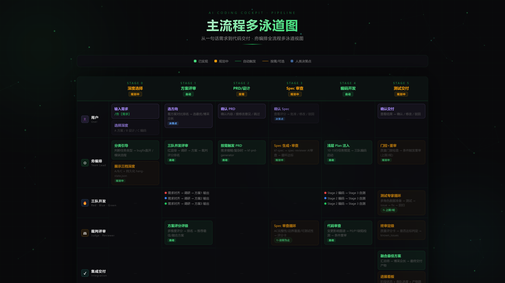

# AI编程智驾 · 用户使用手册

> 基于 [workflow-alignment.md](./workflow-alignment.md) V3 规范 + 当前实现状态
> 适用版本: Phase 0~1 全部实施完成 | 最后更新: 2026.05

---

## 目录

1. [概览 — 一句话说清](#1-概览--一句话说清)
2. [快速上手](#2-快速上手)
3. [深度选择 — 三步定档](#3-深度选择--三步定档)
4. [三种运行模式](#4-三种运行模式)
5. [Pipeline 阶段详解](#5-pipeline-阶段详解)
6. [中断恢复](#6-中断恢复)
7. [进展看板](#7-进展看板)
8. [FAQ](#8-faq)
9. [附录：当前实现状态](#9-附录当前实现状态)

---

## 1. 概览 — 一句话说清

**入口只有 `/夯` 一个。**

夯自动判断任务类型、自动编排流程、自动引导你选择深度。
你只在关键决策点做选择题，不手动触发中间步骤。

```
一句话需求 → /夯 → 夯自动编排 → 三队竞争产出 → 你选方向 → 交付
```

> **核心理念**: 人类做决策，AI 做执行。既不撒手不管，也不手把手教。

---

## 2. 快速上手

### 2.1 最简单的用法

```bash
/夯 帮我开发一个用户登录模块
```

夯会自动:
1. 判断任务类型（新模块 → 走完整流程）
2. 展示三个深度选项（见下节）
3. 启动三队并发方案评审
4. 输出方案对比 → 你选方向 → 继续 Pipeline

### 2.2 快速模式（跳过流程直接开干）

```bash
/夯 --fast 修复登录页的按钮样式
```

夯会自动识别为小改动 → 跳过所有流程 → 直接开发。

### 2.3 增强模式（核心模块用这个）

```bash
/夯 --thorough 开发支付系统
```

开启完整闭环：深度选择 + 3轮Spec审查 + 完整测试循环（3轮）+ 条件重审。

---

## 3. 深度选择 — 三步定档

夯检测到需要分步流程时，**自动展示**三个深度选项：

```
┌─ 夯 执行深度选择 ──────────────────────────────────────┐
│                                                          │
│  你想做到哪一步？                                        │
│                                                          │
│    A. 需求分析 + 方案评审                                │
│       产出: PRD + 方案对比报告                           │
│       后续: 可随时恢复继续                               │
│                                                          │
│    B. 需求 + 设计                                        │
│       产出: PRD + 架构方案 + 数据模型                    │
│       后续: 可随时恢复继续                               │
│                                                          │
│    C. 全流程编码交付（默认）                              │
│       产出: 代码 + 测试报告 + 审查报告                   │
│                                                          │
│  请回复 A/B/C（默认 C）                                  │
└──────────────────────────────────────────────────────────┘
```

| 档位 | 适用场景 | 走完 Stage | 耗时 |
|------|---------|-----------|------|
| **A** | 调研型任务、技术选型、方案评审 | 0→1 | ~5-10min |
| **B** | 架构设计、数据模型设计、技术方案 | 0→1→2 | ~10-20min |
| **C** | 完整功能开发、模块交付 | 0→1→2→3→4→5 | ~15-60min |

> **注意**: 深度选择功能目前规划中（Phase 0.6），当前默认全流程走 C 路径。选 A/B 后可随时恢复，继续对话或用夯启动编码。

---

## 4. 三种运行模式

| 模式 | 触发 | 适用场景 | 深度选择 | Spec 审查 | 测试循环 | 条件重审 |
|------|------|---------|---------|----------|---------|---------|
| **快速** | `/夯 --fast` | 修复、小改 | 跳过 | 跳过 | 跳过 | 跳过 |
| **均衡** | `/夯 [需求]`（默认） | 大多数开发 | 展示深度 → 默认C | Spec + 1轮审查 | P0 触发重审 + 1 轮 | 关闭 |
| **增强** | `/夯 --thorough` | 核心模块 | 展示深度 → 锁定C | Spec + 3轮审查 | 完整3轮循环 | 开启 |

---

## 5. Pipeline 阶段详解

> 下图为完整 Pipeline 多泳道流程图（点击放大）:



### Stage 0 — 深度选择

| 项目 | 内容 |
|------|------|
| **触发条件** | 夯判断需要分步流程时自动展示 |
| **执行** | Team Lead 展示三档（A/B/C），用户回复选择 |
| **状态持久化** | 写入 `.claude-flow/hang-state.json` |
| **当前状态** | ✅ 已实现（`hang-state-manager.cjs`） |
| **跳过条件** | `--fast` 或需求极其简单 |

### Stage 1 — 方案评审（自动）

| 项目 | 内容 |
|------|------|
| **触发条件** | 任务明确是系统/模块/新功能时自动执行 |
| **执行** | 夯三队并发: 需求对齐 → 调研 → 方案输出 → 裁判评分 |
| **人类角色** | 看方案对比排名 → 选方向 / 博采众长 |
| **产出** | `方案评审报告.md` |
| **当前状态** | ✅ 已实现 |

### Stage 2 — PRD 生成（按需自动）

| 项目 | 内容 |
|------|------|
| **触发条件** | 夯判断需求模糊/复杂/跨功能时自动触发 |
| **执行** | `kf-prd-generator` → `kf-alignment` 对齐 |
| **人类角色** | 确认 PRD 内容 / 修改 / 跳过 |
| **产出** | `PRD.md` |
| **当前状态** | ✅ 已实现 |
| **跳过条件** | 需求已足够清晰 |

### Stage 3 — Spec 生成 + 审查闭环

```
夯检测到需要编码开发
  │
  ├─ kf-spec 生成 spec.md
  │   └─ 内含: 功能列表、AC、边界情况、测试策略
  │
  ├─ spec-reviewer agent（pro 模型）
  │   ├─ 审查: AC 可测性、边界覆盖、依赖完整
  │   ├─ 评分: 质量评分卡
  │   └─ 达标: 评分 >= 70, 无 P0 缺陷
  │
  ├─ 不达标 → reviewer 出 issue → kf-spec 修复 → 重审（上限3轮）
  │
  └─ 达标后 → 人类确认 → approve → 锁定 spec.md
```

| 项目 | 内容 |
|------|------|
| **触发条件** | 夯判断需要编码开发时自动执行 |
| **自动调用** | `kf-spec`（生成）+ `spec-reviewer.cjs`（自动审查，5 维评分 + 3 轮循环） |
| **循环上限** | 3 轮，超限则升级为人类介入 |
| **人类角色** | 最终确认（不是参与审查循环） |
| **产出** | `spec.md` + `spec-quality-report.md` |
| **当前状态** | ✅ 已实现（`.claude/helpers/spec-reviewer.cjs`） |

### Stage 4 — 三队开发执行

| 阶段 | 内容 |
|------|------|
| Stage 2 | 三队并行编码（基于 approved spec.md） |
| Stage 3 | 测试专家循环（V3 核心改进） |
| Stage 4 | 代码审查 + 条件重审 |

**测试专家循环**（`node .claude/helpers/test-cycle-manager.cjs`）:

```
Stage 2 编码完成
  │
  └─ Stage 3: 测试专家循环
       │
       ├─ Round 1: 测试数据准备 + 多角色场景
       │   ├─ 角色: 管理员、普通用户、游客
       │   ├─ 权限: 有权限/无权限/边界
       │   ├─ 数据: 空数据、临界值、异常值
       │   └─ 输出: {team}-03-issues.md
       │
       └─ 循环门控:
            ├─ issue == 0 → 通过
            ├─ round < 3 → fix → 回归
            ├─ round >= 3 递减 → 通过 + known_issues
            └─ round >= 3 持平 → UNRESOLVED + 升级
```

| 项目 | 内容 |
|------|------|
| **当前状态** | Stage 2 编码 ✅ 已实现 / Stage 3 测试循环 ✅ 已实现（`test-cycle-manager.cjs`） |
| **代码审查** | ✅ 已实现（`kf-code-review-graph` + `review-rerun-check.cjs` 条件重审） |
| **条件重审** | ✅ 已实现（`.claude/helpers/review-rerun-check.cjs`） |

### Stage 5 — 汇总交付

- 汇总师融合三队最佳方案
- 输出最终交付产物
- 人类确认 → 完成

---

## 6. 中断恢复

夯支持**中断恢复** — 任何时候都可以安全退出，下次回来继续。

### 恢复机制（`hang-state-manager.cjs --recovery`）

检测到 `.claude-flow/hang-state.json` 时自动展示：

```
┌─ 夯 恢复检测 ────────────────────────────────────────────┐
│                                                           │
│  检测到上次任务「xxx」停在「方案评审」阶段               │
│                                                           │
│  你要怎么继续？                                           │
│    A. 继续对话（自然推进，不调技能）                      │
│    B. gspowers 引导（分步导航模式）                      │
│    C. 夯启动编码 Pipeline（多 Agent 并发）                │
│                                                           │
│  请回复 A/B/C                                            │
└───────────────────────────────────────────────────────────┘
```

### 自动恢复流程

检测到 `.claude-flow/hang-state.json` 时自动展示恢复看板：

2. **重新 `/夯`** — 重新启动任务（hang-state-manager.cjs 自动检测并展示三档恢复）
3. **手动查看产物** — 检查 `docs/` 下已有的产物文件

---

## 7. 进展看板

> **当前状态**: ✅ 已实现（`hang-state-manager.cjs --dashboard`）

最终形态的看板将实时展示：

```
┌─ 夯 执行看板 ────────────────────────────────────────────┐
│  任务: 登录模块  深度: C  状态: 执行中                   │
│  [需求 ✅] → [设计 ✅] → [编码 🔄] → [测试 ⏳] → [审查 ⏳] │
│  红队 ████████████░░░ 70%  蓝队 █████████░░░░░░ 45%     │
│  产物: docs/红队-01-架构方案.md (审查中)                   │
└───────────────────────────────────────────────────────────┘
```

当前可通过 `/go` 查看工作流导航，或执行 `node .claude/helpers/hang-state-manager.cjs --dashboard` 查看 ASCII 看板。

---

## 8. FAQ

### Q: 夯和三方协作（triple）有什么区别？

| | 夯（kf-multi-team-compete） | triple（kf-triple-collaboration） |
|---|---|---|
| 规模 | 三队 Pipeline 并发（12+ 技能） | 轻量三角色并行 |
| 适合 | 完整功能开发、模块交付 | 代码审查、方案讨论 |
| 启动 | `/夯 [任务]` | `triple [任务]` |

### Q: 如何跳过不需要的阶段？

- 小改动 → 用 `--fast` 跳过所有流程
- 需求清晰 → 直接描述需求，夯会自动减少不必要的阶段
- 不需要原型 → 回复"跳过"即可

### Q: 三队竞争会不会浪费 Token？

三队共享同一套缓存前缀，利用 DeepSeek KV Cache 技术（120x 差价），N 队成本 ≈ 1 + (N-1)×2%。实际成本增加很小。

### Q: 怎么查看当前进度？

- **实时** → 夯每次交互自动展示进度
- **导航** → `/go` 查看工作流全貌
- **看板**（规划中）→ 浏览器访问监测者仪表盘

### Q: 整个工程如何与gspowers等独立开源项目叠加融合？凭什么能省、能夯、且稳？

本工程并非简单的"gspowers + 一堆技能"堆砌，而是一个**四层融合架构**，每一层都注入了其他独立工具不具备的能力：

```
┌─ 路由层 ──────────────────────────────────────────────┐
│  kf-model-router（三位一体）                            │
│  语义任务分类 → 加权评分 → 模型分配                     │
│  断路器 + 降级链 + 令牌桶限流 + 密钥隔离                 │
├─ 编排层 ──────────────────────────────────────────────┤
│  kf-multi-team-compete（/夯）+ gspowers Pipeline 引擎   │
│  三队红蓝绿并发竞争 + 裁判评分 + 融合交付                │
│  claude-code-pro 智能调度（不 spawn 则省 10K-15K）      │
├─ 执行层 ──────────────────────────────────────────────┤
│  100+ 技能按需调用（kf- 系列 32 + JeffAllan 66）        │
│  lambda-lang A2A 通信（3x 压缩）                        │
│  lean-ctx 上下文压缩（90+ 模式）                        │
├─ 验证层 ──────────────────────────────────────────────┤
│  每阶段门控检查 → P0 技能未用则告警                     │
│  条件重审（P0/P1 密度检测，上限 3 轮）                  │
│  测试专家循环（54 场景全矩阵）                          │
└──────────────────────────────────────────────────────┘
```

**对比传统方案**：

| 维度 | 单独用 gspowers | 单独用 CCP | 堆砌 100 技能 | **本工程（融合后）** |
|------|:--:|:--:|:--:|:--:|
| 流程编排 | ✓ 分步导航 | — | — | ✓ gspowers Pipeline 引擎 |
| 模型路由 | — | — | — | ✓ 三位一体智能路由 |
| Token 节省 | — | ✓ 跳 spawn | — | ✓ 四层压缩叠加 |
| 多队竞争 | — | — | — | ✓ 红蓝绿三哲学并行 |
| 技能调度 | — | — | ⚠ 靠运气 | ✓ 路由表注入 + 门控验证 |
| 质量保证 | — | — | — | ✓ 每阶段硬 Gate |
| 中断恢复 | — | — | — | ✓ hang-state 持久化 |

**凭什么省**：四层压缩叠加生效——
- lean-ctx（上下文压缩，90+ 模式）
- lambda-lang（A2A 通信协议，3x 压缩）
- claude-code-pro（智能跳过 spawn，省 10K-15K/次）
- DeepSeek KV Cache（共享前缀，120x 差价）

**凭什么夯**：三队竞争 + 裁判 + 融合——
- 红队（激进创新）：用最新方案、semantic routing、cutting-edge
- 蓝队（稳健可靠）：用成熟方案、安全路由、向后兼容
- 绿队（平衡务实）：博采众长、成本优先、实用主义
- 裁判 5 维评分（完整性/可行性/创新性/可维护性/成本）→ 融合师择优组合

**凭什么稳**——
- 每阶段门控：Stage 完成后自动扫描产出，P0 技能未触发 → 告警+建议重跑
- 条件重审：`review-rerun-check.cjs` 检测 P0/P1 密度，自动触发重审
- 断路器 + 降级链：模型故障时自动 fallback，不中断 Pipeline
- hang-state 持久化：任何时候中断可恢复，不丢进度

**技能路由改造如何保障稳定调用**：
- **注入**：每个 spawned agent 的 prompt 注入阶段路由表（~190 token），agent 一眼看清该用哪个技能
- **门控**：阶段完成后 `skill-router.cjs --verify` 扫描输出，P0 技能缺失则告警
- **维护**：`build-skill-registry.cjs` 从所有 SKILL.md 自动生成注册表，技能变更时自动重建

### Q: 哪些是已实现的，哪些还在规划中？

见下一节附录。

---

## 9. 附录：当前实现状态

### 已实现 ✅

| 功能 | 入口/路径 | 说明 |
|------|----------|------|
| `/夯` 基本入口 | 用户输入 | 启动三队 Pipeline |
| 方案评审（S1） | 自动 | 三队并发出方案 → 裁判评分排名 |
| PRD 生成（S2） | 按需自动 | kf-prd-generator |
| Stage 2 编码（S4） | 自动 | 三队并行开发 |
| 代码审查（S4） | 自动 | kf-code-review-graph |
| 汇总交付 | 自动 | 汇总师融合最佳方案 |
| kf-spec 基本生成 | 手动 | 需用户主动触发 |
| 三类模式区分 | 用户指定 | --fast / 默认 / --thorough |
| 模型路由 | 全自动 | kf-model-router 动态切换 |
| Token 节省 | 全自动 | lean-ctx + CCP + KV Cache |
| 监测者仪表盘 | 全自动 | http://localhost:3456 |
| **hammer-bridge.cjs** | `.claude/helpers/hammer-bridge.cjs` | 核心编排助手：Agent 状态追踪 + 重试队列 + 失活检测 + Token 聚合 + A2A 通知桥 + Fix Protocol |
| **深度选择（Stage 0）** | `hang-state-manager.cjs --init --depth` | Phase 0.6：A/B/C 三档 + 状态持久化到 hang-state.json |
| **进展看板** | `hang-state-manager.cjs --dashboard` | Phase 0.7：hang-state.json 可视化 ASCII 看板 |
| **Spec Reviewer AI** | `spec-reviewer.cjs review` | Phase 1.x：自动审查 spec.md，5 维评分 + 3 轮修复循环 |
| **测试专家循环** | `test-cycle-manager.cjs round` | Phase 1.5：54 场景全矩阵（3角色×3权限×3数据×2路径）+ 3 轮闭环 |
| **条件重审机制** | `review-rerun-check.cjs` | Phase 1.2：P0/P1 密度自动触发重审（上限 3 轮） |
| **中断恢复** | `hang-state-manager.cjs --recovery` | Phase 0.6：hang-state → 三档恢复看板（A/B/C） |
| **浅层 Plan 注入** | `plan-preview.cjs --inject` | Phase 0.3：10-15 行任务拆解预览，30s 打断窗口 |
| **反转门控硬 Gate** | `gate-executor.cjs --scan` | Phase 0.5：Pipeline DAG 自动门禁，状态机 IDLE→SCANNING→WAITING→BROADCAST→PASSED |

### 状态图例

```
✅ 已实现      ⏳ 规划中      🚧 部分实现
```

---

> **一句话总结**: 入口只有 `/夯`。夯先问你想做到哪一步（A/B/C），然后自动引导你走完。选 A/B 可随时恢复。全流程下三队竞争 + 裁判择优 + 测试闭环。每一步都有看板告诉你现在在哪。

> 有问题随时说 `/go` 查看导航，或直接提问。
